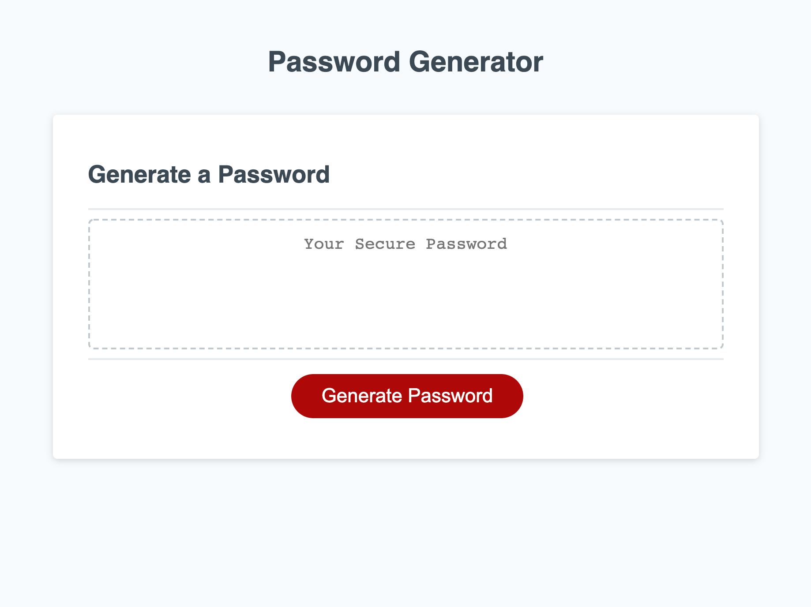

# Password-Generator#
  ## Table of Contents:
  * [Description](#Description)

  * [Website](#Website)

  * [Languages-Used](#Languages-Used)

  * [License](#License)
  
  * [Contact](#Contact)
    
  
  ## Description:
    This is a password generator that I helped create with javascript. I was given this project with the HTML and CSS already created; my task was to complete the javascript. 
    My task was to prompt the user to choose the criteria for their password and have it displayed on the text area when the generate button is clicked. The criteria consisted of length, capital letters, special characters, and/or numbers in their password. 

  ## Website:
  Deployed Site here: https://josejrrosas.github.io/Password-Generator/
  

  
  ## Languages-Used:
 * HTML
 * CSS
 * Javascript

  ## License:
    SMU bootcamp
  ## Contact: 
    * Name: Jose Rosas
    * Github: ( https://github.com/josejrrosas)
    * Email : Josejrrosas@yahoo.com